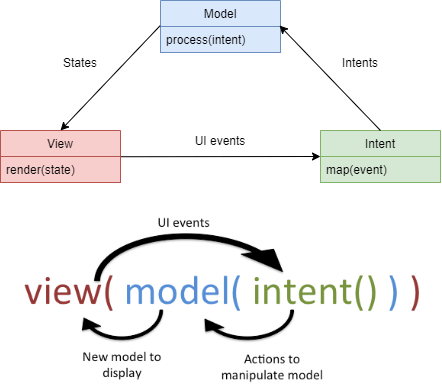

# MVI-with-Coroutine-Flow
MVI Architecture for Android projects.

This repository contains a sample app that implements MVI architecture using Retrofit, ViewModel, Coroutines and Flow of Kotlin.

Coroutines + Flow = MVI :heart:. 

MVI pattern
-------------------
This pattern was specified by [André Medeiros (Staltz)](https://twitter.com/andrestaltz) for a JavaScript framework he has written called [cycle.js](https://cycle.js.org).

From a theoretical (and mathematical) point of view we could describe Model-View-Intent as follows:

* `intent()`: This function takes the input from the user (i.e. UI events, like click events) and translate it to “something” that will be passed as parameter to `model()` function. This could be a simple string to set a value of the model to or more complex data structure like an `Object`. We could say we have the intention to change the model with an intent.
* `model()`: The `model()` function takes the output from `intent()` as input to manipulate the `Model`. The output of this function is a new `Model` (state changed). So it should not update an already existing `Model`. We want immutability! We don’t change an already existing `Model` object instance. We create a new `Model` according to the changes described by the intent. Please note, that the `model()` function is the only piece of your code that is allowed to create a new `Model` object. Then this new immutable `Model` is the output of this function. Basically, the `model()` function calls our apps business logic (could be an `Interactor`, `Usecase`, `Repository` … whatever pattern / terminology you use in your app) and delivers a new `Model` object as result.
* `view()`: This method takes the model returned from `model()` function and gives it as input to the `view()` function. Then the `View` simply displays this `Model` somehow. `view()` is basically the same as `view.render(model)`.

## MIT License

    Copyright (c) 2021 Chen Pan

    Permission is hereby granted, free of charge, to any person obtaining a copy
    of this software and associated documentation files (the "Software"), to deal
    in the Software without restriction, including without limitation the rights
    to use, copy, modify, merge, publish, distribute, sublicense, and/or sell
    copies of the Software, and to permit persons to whom the Software is
    furnished to do so, subject to the following conditions:

    The above copyright notice and this permission notice shall be included in all
    copies or substantial portions of the Software.

    THE SOFTWARE IS PROVIDED "AS IS", WITHOUT WARRANTY OF ANY KIND, EXPRESS OR
    IMPLIED, INCLUDING BUT NOT LIMITED TO THE WARRANTIES OF MERCHANTABILITY,
    FITNESS FOR A PARTICULAR PURPOSE AND NONINFRINGEMENT. IN NO EVENT SHALL THE
    AUTHORS OR COPYRIGHT HOLDERS BE LIABLE FOR ANY CLAIM, DAMAGES OR OTHER
    LIABILITY, WHETHER IN AN ACTION OF CONTRACT, TORT OR OTHERWISE, ARISING FROM,
    OUT OF OR IN CONNECTION WITH THE SOFTWARE OR THE USE OR OTHER DEALINGS IN THE
    SOFTWARE.
